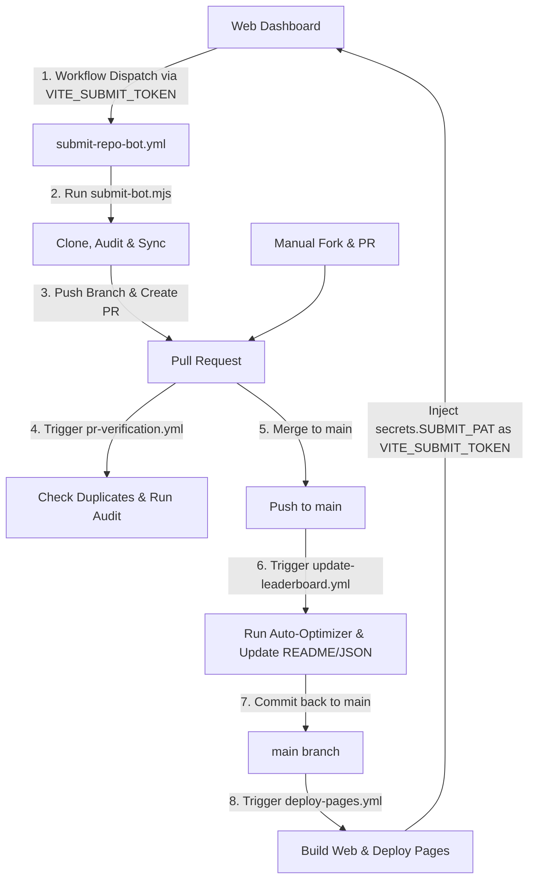

# 🤖 GitHub Actions Leaderboard CI Bot Guide

SkillGauge uses a modular, multi-workflow GitHub Actions CI pipeline designed to handle automated, PR-driven repository submissions securely, run verification checks on manual contributions, maintain the global leaderboard ranking database, and deploy the web interface.

---

## 🔄 Pipeline Architecture & Submission Flow

The system splits responsibilities into four dedicated GitHub Actions workflows to ensure clean separation of concerns, security isolation, and optimal performance:



---

## ⚙️ Workflow Modules Reference

### 1. PR Submission Bot (`.github/workflows/submit-repo-bot.yml`)
This workflow is triggered via `workflow_dispatch` (usually from the SkillGauge website) to automatically scan, audit, and create a submission Pull Request for a remote repository.

*   **Trigger**: `workflow_dispatch` with a input `repository` (the URL to clone).
*   **Permissions**: `contents: write`, `pull-requests: write`.
*   **Script Executed**: [submit-bot.mjs](file:///d:/Code/SkillGauge/scripts/submit-bot.mjs).

```yaml
name: 🤖 SkillGauge PR Submission Bot

on:
  workflow_dispatch:
    inputs:
      repository:
        description: 'The URL of the repository to clone and scan'
        required: true

permissions:
  contents: write
  pull-requests: write

jobs:
  process-submission:
    runs-on: ubuntu-latest
    steps:
      - name: 📁 Checkout Code
        uses: actions/checkout@v4
        with:
          fetch-depth: 0

      - name: 🟢 Setup Node.js
        uses: actions/setup-node@v4
        with:
          node-version: 20
          cache: 'npm'

      - name: 📦 Install Dependencies
        run: npm install

      - name: 🔨 Build Core & CLI
        run: |
          npm run build -w packages/core
          npm run build -w packages/cli

      - name: 🤖 Process Submission
        env:
          GITHUB_TOKEN: ${{ secrets.GITHUB_TOKEN }}
        run: |
          node scripts/submit-bot.mjs --repository "${{ github.event.inputs.repository }}"
```

---

### 2. Manual PR Verification (`.github/workflows/pr-verification.yml`)
This workflow validates all incoming Pull Requests modifying the `skills/**/*.md` folder. It runs anti-spam duplicate checks and publishes a detailed audit report.

*   **Trigger**: `pull_request` on branches targeting `main` with modifications in `skills/**/*.md`.
*   **Permissions**: `contents: read`, `pull-requests: write`.

```yaml
name: 🔍 Manual PR Skills Verification

on:
  pull_request:
    types: [opened, synchronize]
    paths:
      - 'skills/**/*.md'

permissions:
  contents: read
  pull-requests: write

jobs:
  verify:
    runs-on: ubuntu-latest
    steps:
      - name: 📁 Checkout Code
        uses: actions/checkout@v4
        with:
          fetch-depth: 0

      - name: 🟢 Setup Node.js
        uses: actions/setup-node@v4
        with:
          node-version: 20
          cache: 'npm'

      - name: 📦 Install Dependencies
        run: npm install

      - name: 🔨 Build Core & CLI
        run: |
          npm run build -w packages/core
          npm run build -w packages/cli

      - name: 🛡️ Run Anti-Spam Check
        id: anti_spam
        continue-on-error: true
        run: |
          node packages/cli/dist/index.js check-duplicate --target "skills/**/*.md" --db "leaderboard.json"
          echo "exit_code=$?" >> $GITHUB_ENV

      - name: 🚨 Handle Duplicate PR
        if: env.exit_code == '2'
        env:
          GH_TOKEN: ${{ secrets.GITHUB_TOKEN }}
        run: |
          gh pr comment ${{ github.event.pull_request.number }} --body "🚨 **SkillGauge Audit Warning:** This skill matches an existing entry on the leaderboard. To prevent spam and plagiarized content, duplicate submissions are automatically rejected."
          exit 1

      - name: 🔬 Run SkillGauge Audit
        run: |
          node packages/cli/dist/index.js audit "skills/**/*.md" --fail-under 0 --summary summary.md

      - name: 📤 Publish Step Summary
        run: cat summary.md >> $GITHUB_STEP_SUMMARY
```

---

### 3. Update Leaderboard database (`.github/workflows/update-leaderboard.yml`)
When changes are merged into the `main` branch, this workflow runs in-place prompt optimization, syncs local data bundles, regenerates the leaderboard JSON database and updates the root `README.md` ranking table.

*   **Trigger**: `push` to `main` affecting `skills/**/*.md`.
*   **Permissions**: `contents: write`.

```yaml
name: 📈 Update Leaderboard on Main

on:
  push:
    branches:
      - main
    paths:
      - 'skills/**/*.md'

permissions:
  contents: write

jobs:
  update:
    runs-on: ubuntu-latest
    steps:
      - name: 📁 Checkout Code
        uses: actions/checkout@v4
        with:
          fetch-depth: 0

      - name: 🟢 Setup Node.js
        uses: actions/setup-node@v4
        with:
          node-version: 20
          cache: 'npm'

      - name: 📦 Install Dependencies
        run: npm install

      - name: 🔨 Build Core & CLI
        run: |
          npm run build -w packages/core
          npm run build -w packages/cli

      - name: 🚀 Run Auto-Optimizer
        run: |
          node packages/cli/dist/index.js optimize "skills/**/*.md"

      - name: 🔄 Sync Local Data
        run: |
          node scripts/sync-skills.js

      - name: 📈 Update Leaderboard JSON & README
        run: |
          # Extract author of the latest commit to record in the database
          AUTHOR=$(git log -1 --pretty=format:'%an')
          node packages/cli/dist/index.js update-leaderboard --author "$AUTHOR" --db "leaderboard.json" --readme "README.md" --target "skills/**/*.md"

      - name: 💾 Commit and Push Leaderboard Updates
        run: |
          git config user.name "github-actions[bot]"
          git config user.email "41898282+github-actions[bot]@users.noreply.github.com"
          git add .
          git diff-index --quiet HEAD || (git commit -m "chore: update leaderboard and optimize skills [skip ci]" && git push)
```

---

### 4. Deploy Dashboard (`.github/workflows/deploy-pages.yml`)
This workflow compiles the frontend packages, injects the build-time submission token, and publishes the static web dashboard assets to GitHub Pages.

*   **Trigger**: `push` on `main` affecting web/core packages, leaderboard database, sync script, or the deploy workflow itself.
*   **Permissions**: `contents: read`, `pages: write`, `id-token: write`.

```yaml
name: 🚀 Deploy Web Dashboard to GitHub Pages

on:
  push:
    branches:
      - main
    paths:
      - 'packages/web/**'
      - 'packages/core/**'
      - 'leaderboard.json'
      - 'scripts/sync-skills.js'
      - '.github/workflows/deploy-pages.yml'
  workflow_dispatch:

permissions:
  contents: read
  pages: write
  id-token: write

concurrency:
  group: 'pages'
  cancel-in-progress: true

jobs:
  deploy:
    environment:
      name: github-pages
      url: ${{ steps.deployment.outputs.page_url }}
    runs-on: ubuntu-latest
    steps:
      - name: 📁 Checkout Code
        uses: actions/checkout@v4

      - name: 🟢 Setup Node.js
        uses: actions/setup-node@v4
        with:
          node-version: 20
          cache: 'npm'

      - name: 📦 Install Dependencies
        run: npm install

      - name: 🔨 Build Core & Web Dashboard
        env:
          VITE_SUBMIT_TOKEN: ${{ secrets.SUBMIT_PAT }}
        run: |
          npm run build -w packages/core
          npm run web:build

      - name: 🔧 Setup Pages
        uses: actions/configure-pages@v4

      - name: 📤 Upload Artifact
        uses: actions/upload-pages-artifact@v3
        with:
          path: 'packages/web/dist'

      - name: 🚀 Deploy to GitHub Pages
        id: deployment
        uses: actions/deploy-pages@v4
```

---

## 🔒 Security Configuration Guide

To enable automated PR creation and support repository dispatch calls, you must set up correct repository variables and secrets on GitHub:

### 1. Enable Pull Request Creation in Actions
By default, GitHub Actions are restricted from creating or approving Pull Requests. To lift this constraint:
1. Go to your repository **Settings** > **Actions** > **General**.
2. Scroll to the **Workflow permissions** section.
3. Select **Read and write permissions**.
4. Check **Allow GitHub Actions to create and approve pull requests**.
5. Click **Save**.

### 2. Configure `SUBMIT_PAT` Secret
Because the client-side website needs to trigger a `workflow_dispatch` on your repository to execute the bot, it requires an API token.
To keep the main repository secure, configure a **Fine-grained Personal Access Token** with restricted scopes:
1. Go to your GitHub account **Settings** > **Developer settings** > **Personal access tokens** > **Fine-grained tokens**.
2. Click **Generate new token**.
3. Set Repository access to **Only select repositories** and pick your `SkillGauge` repository.
4. Under **Permissions**, select:
   * **Actions**: **Read and write** (required to dispatch workflows).
   * **Contents**: **Read and write** (required to checkout and read paths).
5. Generate the token.
6. Copy the token, then navigate to your repository's **Settings** > **Secrets and variables** > **Actions**.
7. Click **New repository secret**, name it `SUBMIT_PAT`, and paste the copied token.

During the compilation process, this token will be injected securely into the static HTML/JS bundle under the environment variable `VITE_SUBMIT_TOKEN`, allowing the website's Submit button to trigger the bot.

