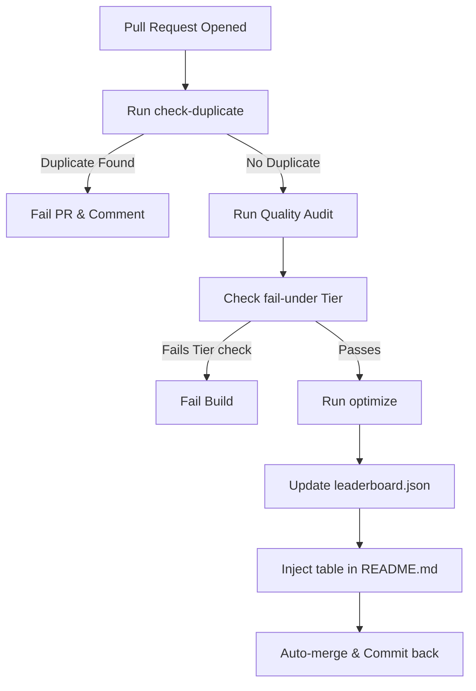

# 🤖 GitHub Actions Leaderboard CI Bot

SkillGauge provides a serverless CI workflow at `.github/workflows/leaderboard-bot.yml` to automate the submission, validation, and publishing of agent skills.

## 🔄 Workflow Diagram

---

## 🛠️ Pipeline Stages

### 1. Verification & Anti-Spam
On every pull request targeting `skills/**/*.md`, the pipeline runs the `check-duplicate` command:
*   Checks if the SHA-256 content hash of any submitted file matches an existing entry in `leaderboard.json`.
*   Checks if the resolved name `[Repository] - [Skill Name]` clashes with any existing entry.
*   If a duplicate is found, the PR build fails to prevent spam submissions.

### 2. Scientific Audit
Runs the `audit` command and outputs a step summary report:
*   Computes scores across the 7 dimensions.
*   Determines if the skill meets quality bounds (e.g. `fail-under` options).

### 3. Prompt Optimization
Runs the `optimize` command to refactor files in-place:
*   Prunes redundant markdown lines and formatting bloat.
*   Injects safety structure guidelines if missing.
*   Saves the refined prompts back to the branch.

### 4. Leaderboard Publishing
*   Updates the centralized `leaderboard.json` database.
*   Injects the updated markdown ranking table in `README.md`.
*   Pushes the changes back to the main branch automatically.
