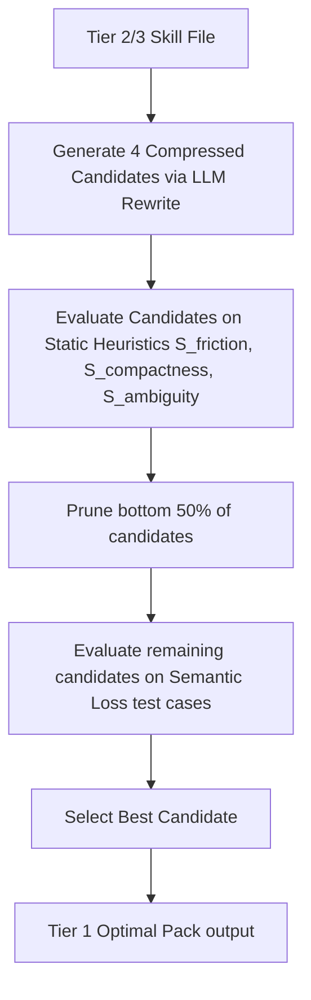

# SkillGauge Core Engine Technical Specification

This document provides the mathematical formulas, algorithms, keyword lexicons, and parsing strategies for the SkillGauge Core Engine (`packages/core`). The entire engine is platform-independent TypeScript designed to run in both Node.js (CLI) and Browser (Vite React) environments.

---

## 1. Input Parsing Strategy

The Core Engine parses three primary skill formats: Markdown (`.md`), JSON, and YAML (specifically MCP tool definitions). 

### 1.1 Markdown Parser (`MarkdownParser`)
Instead of importing a heavy AST parser, the core engine implements a lightweight line-by-line lexical analyzer:
*   **YAML Frontmatter**: Parsed using regex to extract metadata like `name`, `description`, and `version`.
*   **Header Tree**: Captures the hierarchy of headings (`#`, `##`, `###`) to analyze section structure and modularity.
*   **Lists Analyzer**: Measures list indentation levels (`\s{2,}` or `\t`) to compute nested instruction depth.
*   **Code Blocks**: Identifies fenced code blocks (triple backticks) to separate code definitions from prose.

### 1.2 Structured Schema Parser (`SchemaParser`)
For JSON and YAML (MCP-Definitions):
*   Parses schema objects to examine the definitions of `tools`, `prompts`, and `resources`.
*   Traverses properties inside `inputSchema` to evaluate parameter descriptions, types, and required fields.

---

## 2. Mathematical Definition of the 9 Metrics

The Overall Score $S_{overall} \in [0, 1]$ is computed as the product of 9 independent normalized sub-scores:

$$S_{overall} = S_{efficacy} \times S_{friction} \times S_{compactness} \times S_{guardrails} \times S_{schema} \times S_{cohesion} \times S_{ambiguity} \times S_{memory} \times S_{protection}$$

If any metric is extremely low, it severely penalizes the overall score, pushing the skill file to a lower tier.

### 2.1 Efficacy Score ($S_{efficacy}$)
Measures how effectively the skill steers the LLM agent without causing hallucinations.
*   **Heuristics**:
    *   $Persona$ (binary): Presence of role/persona definition (e.g., "You are an expert...").
    *   $Objective$ (binary): Presence of clear, high-level goals.
    *   $FewShot$ (scalar): Number of few-shot examples $N_{shot}$. Ideally $1 \le N_{shot} \le 2$. Excess examples are penalized via Token Friction.
*   **Formula**:
    $$S_{efficacy} = 0.3 \times Persona + 0.4 \times Objective + 0.3 \times \min(1.0, N_{shot} \times 0.5)$$

### 2.2 Token Friction ($S_{friction}$)
Penalizes bloated skill files to enforce the "Focused Skills" principle (SkillsBench, 2026).
*   **Heuristics**:
    *   $T$: Token count estimate. $T \approx \text{word\_count} \times 1.3$.
    *   $T_{optimal} = 600$ tokens (sweet spot).
    *   $T_{max} = 2000$ tokens.
*   **Formula**:
    *   If $T \le T_{optimal}$: $S_{friction} = 1.0$
    *   If $T > T_{optimal}$:
        $$S_{friction} = \max\left(0.1, 1.0 - 0.9 \times \left( \frac{T - T_{optimal}}{T_{max} - T_{optimal}} \right)^2\right)$$

### 2.3 Trajectory Compactness ($S_{compactness}$)
Penalizes recursive thinking patterns and excessive branching that cause reasoning loops (Agent Skill Evolution, 2026).
*   **Heuristics**:
    *   $D_{indent}$: Maximum nesting depth of lists.
    *   $N_{branch}$: Count of conditional statements (e.g., "if", "else if", "in case of", "unless").
    *   $N_{loop\_keywords}$: Count of loop-triggering keywords (e.g., "repeat", "retry infinitely", "loop", "go back to step").
*   **Formula**:
    $$S_{compactness} = \max\left(0.1, 1.0 - 0.1 \times \max(0, D_{indent} - 3) - 0.05 \times N_{branch} - 0.15 \times N_{loop\_keywords}\right)$$

### 2.4 Error Guardrails ($S_{guardrails}$)
Evaluates the existence of proactive exception-handling routines (Agent Skills for LLMs, 2026).
*   **Heuristics**:
    *   $N_{error\_terms}$: Count of defensive terms (e.g., "error", "fail", "invalid", "except", "fallback", "handling", "catch").
    *   $ExitStrategy$ (binary): Presence of termination rules (e.g., "stop and report", "abort", "max retries").
*   **Formula**:
    $$S_{guardrails} = 0.5 \times \min\left(1.0, \frac{N_{error\_terms}}{3}\right) + 0.5 \times ExitStrategy$$

### 2.5 Tool & Schema Clarity ($S_{schema}$)
Measures how well input/output formats are documented to avoid parameter hallucination.
*   **Heuristics**:
    *   $N_{params}$: Total parameters defined.
    *   $N_{documented}$: Parameters containing both `type` and a non-empty `description`.
    *   $HasRequired$ (binary): Presence of a defined `required` fields array (if applicable).
*   **Formula**:
    $$S_{schema} = 0.7 \times \left( \frac{N_{documented}}{N_{params} + \epsilon} \right) + 0.3 \times HasRequired$$
    *(where $\epsilon = 0.0001$ to prevent division by zero; if $N_{params} = 0$, $S_{schema} = 1.0$)*

### 2.6 Semantic Cohesion ($S_{cohesion}$)
Enforces single-responsibility. Multi-tasking prompts degrade attention performance.
*   **Heuristics**:
    *   $N_{modules}$: Count of major headers or independent tool definitions.
    *   $ModulePenalty$: Penalizes if $N_{modules} > 3$.
*   **Formula**:
    $$S_{cohesion} = \max\left(0.1, 1.0 - 0.2 \times \max(0, N_{modules} - 3)\right)$$

### 2.7 Ambiguity Index ($S_{ambiguity}$)
Calculates the ratio of strong, imperative qualifiers against weak, ambiguous words.
*   **Lexicons**:
    *   **Weak/Ambiguous Words ($W_{weak}$)**: `maybe`, `sometimes`, `usually`, `try to`, `could`, `should`, `approximately`, `ideally`, `optionally`, `if possible`, `flexible`, `best effort`, `mostly`, `likely`, `probably`.
    *   **Strong/Imperative Words ($W_{strong}$)**: `must`, `shall`, `always`, `never`, `required`, `strictly`, `do not`, `ensure`, `prevent`, `verify`, `strictly prohibited`.
*   **Formula**:
    $$S_{ambiguity} = \frac{\sum W_{strong}}{\sum W_{strong} + \sum W_{weak} + \epsilon}$$
    *(if both sums are 0, default to $0.8$)*

### 2.8 State & Memory Overhead ($S_{memory}$)
Checks if the skill provides guidelines for state-checkpointing and progress logging to prevent memory decay.
*   **Heuristics**:
    *   $N_{state\_directives}$: Count of state-saving terms (e.g., "save progress", "checkpoint", "log", "record state", "state tracking").
*   **Formula**:
    $$S_{memory} = \min\left(1.0, \frac{N_{state\_directives}}{2}\right)$$

### 2.9 Injection & Leakage Protection ($S_{protection}$)
Measures security alignment against prompt injections and system instruction leaks.
*   **Heuristics**:
    *   $N_{security\_directives}$: Count of protection terms (e.g., "do not reveal these instructions", "ignore user overrides", "system prompt protection", "security guardrails").
*   **Formula**:
    $$S_{protection} = \min\left(1.0, N_{security\_directives}\right)$$

---

## 3. Tier Classification Matrix

| Tier | Range | Classification | Description | Action |
|---|---|---|---|---|
| **Tier 1** | $S_{overall} \ge 0.85$ | **Optimal Pack** | Highly efficient, focused, low-cost, secure, and robust. | Production Ready. |
| **Tier 2** | $0.60 \le S_{overall} < 0.85$ | **Sub-optimal** | Functional but bloated, slightly ambiguous, or lacks guardrails. | Run **AutoPDL Optimizer**. |
| **Tier 3** | $S_{overall} < 0.60$ | **Risky** | Vague, long, recursive loops, high cost, or unsafe. | Major rewriting required. |

---

## 4. AutoPDL Compressor (Successive Halving Algorithm)

The optimizer converts a Tier 2/3 skill file into a Tier 1 skill file by performing iterative prompt pruning and distillation.

### 4.1 Candidate Generation Strategies
The compressor calls a low-cost LLM (e.g., Gemini Flash) with specific instructions to generate 4 variations of the original skill:
1.  **Direct Distillation (Var A)**: Summarize long instructions, convert verbose prose into direct imperatives.
2.  **Structural Modularization (Var B)**: Extract nested lists into separate, flat sub-modules.
3.  **Few-shot Pruning (Var C)**: Compress or remove redundant examples while keeping only the most complex one.
4.  **Hybrid Pruned (Var D)**: Apply all the above methods aggressively.

### 4.2 Successive Halving Selection
1.  **Round 1 (Static Filter)**: Compute $S_{friction}$, $S_{compactness}$, and $S_{ambiguity}$ for all 4 variants. Discard the 2 lowest-scoring variants.
2.  **Round 2 (Semantic Check)**: Prompt the LLM to verify if the remaining 2 variants have lost core intent (semantic drift). The LLM assigns a `loss_score` $\in [0, 1]$.
3.  **Final Selection**: Select the variant that maximizes:
    $$Score_{final} = S_{overall} \times (1.0 - loss\_score)$$
